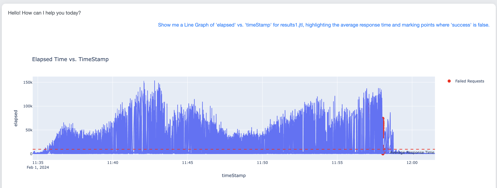
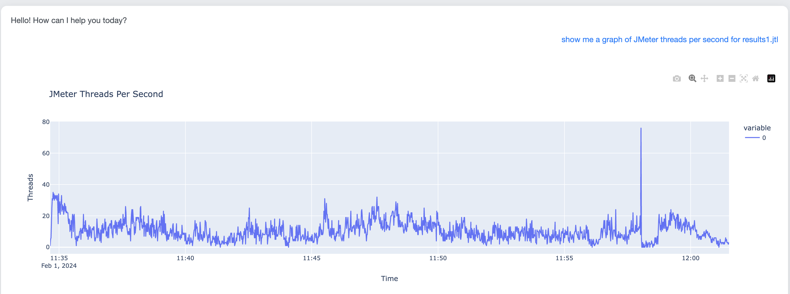
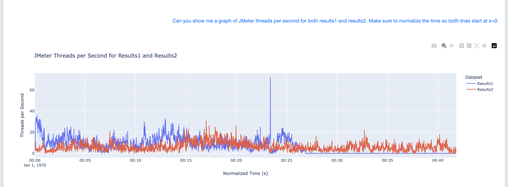

# JMeter JTL LLM Analyzer

A powerful tool for analyzing any CSV files and Excel files with the help of Language Model (LLM) technology. Upload your files, ask insightful questions, and generate informative graphs effortlessly.

## Setup

1. **Install Python:**
   - Ensure you have Python 3.10 or 3.11 installed on your system.

2. **Clone the Repository:**
   ```sh
   git clone git@github.com:redline13/jmeter-jtl-llm.git 
   cd jmeter-jtl-llm

3. **Install Dependencies:**
   ```sh
   pip install -r requirements.txt

4. **Set Up Environment Variables:**

   - Create a `.env` file in the `/WebClient` directory of the project.
   - Add the necessary environment variables to the `.env` file. For example:

    ```env
    openAI_apikey=https://platform.openai.com/api-keys
    ```


## Usage

5. **Startup:**
   - To start the application, Run:
    
    ```sh
    python Webclient/app.py
    
6. **Prompt Creation:**
    - The quality and consistency of the results depend on how specific your prompts are. When generating a graph, for best results it is recommended to give the type of the graph (Line, Bar, etc..), clearly state your X and Y axis when applicable, and give any addition information or requirements nessecary. Specific prompts help ensure that the results are accurate and consistent.

    - On the other hand, abstract or vague prompts are more likely to produce errors, inconsistencies, or unexpected outcomes. By defining your requirements precisely, you can minimize the risk of receiving undesired results.
    
7. **Examples**
   - In this example, the CSV data columns are enclosed in single quotes. Additionally, we clearly specify the type of graph, the filename containing the data, and the extra parameters we requested, which include error points and the average label. This is a very good prompt for graph construction



   - In this example, the prompt is quite abstract, leaving a significant portion of the graph generation to the language model. While you may still receive results, as demonstrated, these outputs are often inconsistent and susceptible to errors.



   - In this final example, we illustrate how to compare two uploaded files within the same graph. It’s essential to normalize the time data when it represents true time values (not starting at 0) to avoid misalignment on the time axis, which could lead to misleading interpretations.

    
